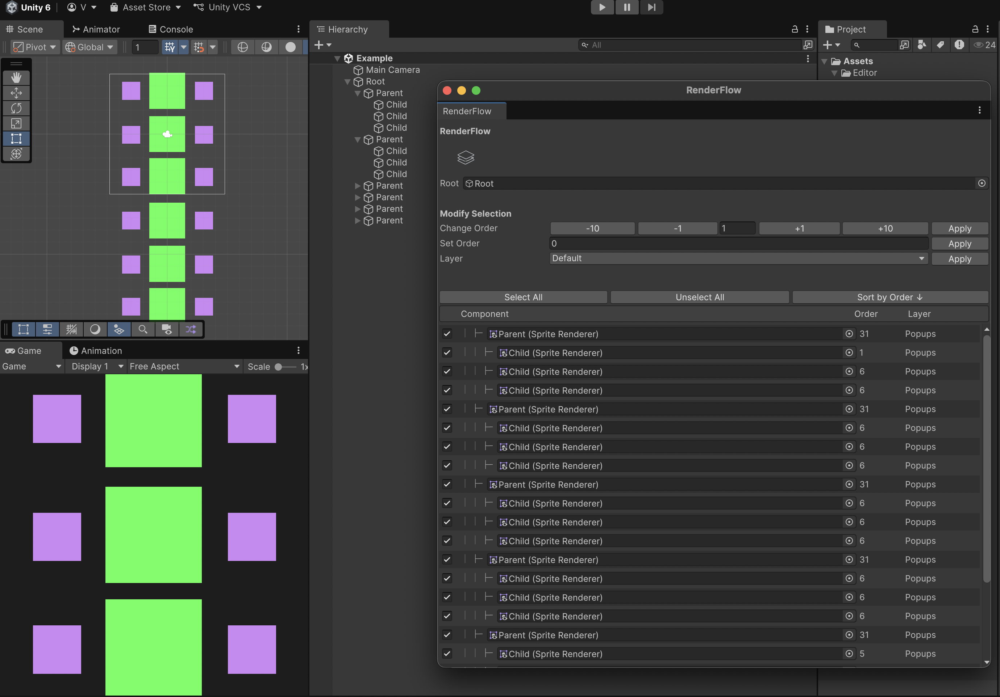

# RenderFlow

A Unity Editor tool for managing Sorting Orders and Sorting Layers across multiple Renderers in a hierarchy — all from a single window.

---

## Features

- **Hierarchy view** — displays all Renderers under a root GameObject with depth indentation mirroring the scene hierarchy
- **Sorting Order display** — shows the current `sortingOrder` of each Renderer in the list
- **Sorting Layer display** — shows the current `sortingLayerName` of each Renderer
- **Batch order editing** — increment or decrement sorting order by ±1 or ±10 across selected Renderers, or set an exact value
- **Batch layer editing** — assign a Sorting Layer to all selected Renderers at once
- **Selection control** — select or deselect individual Renderers via checkboxes, or use Select All / Unselect All
- **Sortable list** — sort the displayed list by Sorting Order ascending or descending
- **Undo support** — all modifications are registered with Unity's Undo system

---

## Installation

1. Copy the `RenderFlow` folder into your project under `Assets/Editor/`
2. Open the tool via **Tools → RenderFlow** or press **Shift + T**

---

## Usage

1. Open the window via **Tools → RenderFlow**
2. Drag a root GameObject into the **Root** field
3. All Renderers in the hierarchy will appear in the list — all selected by default
4. Use checkboxes to select the Renderers you want to modify
5. Apply changes using the **Change Order**, **Set Order**, or **Layer** controls

---

No external dependencies
